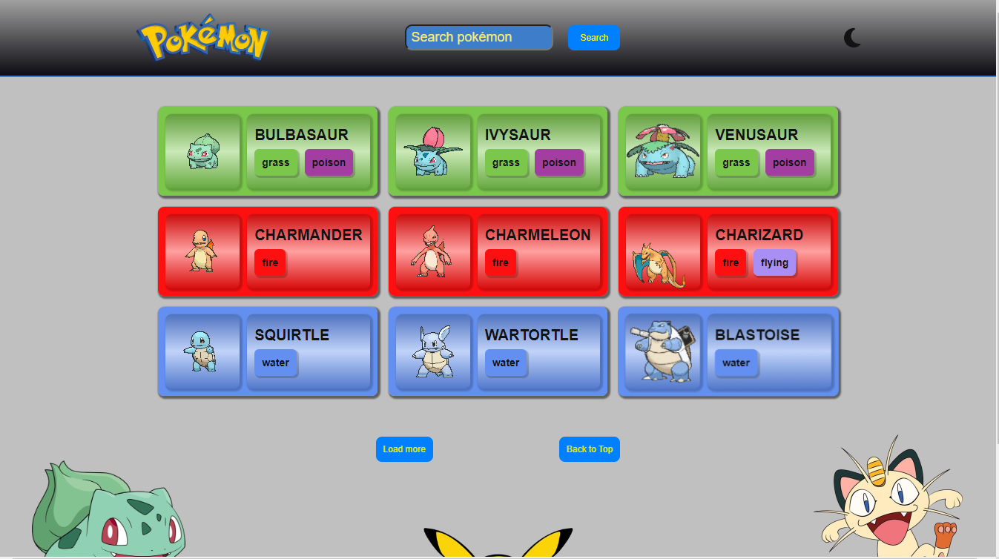

# Pokedex

## Descrição
Esta aplicação permite que você navegue e veja informações sobre vários Pokémon.

## Funcionalidades

- **Carregar Pokémon**: Inicialmente carrega 9 Pokémons e carrega mais à medida que você clica no botão "Load More".
- **Ver Detalhes**: Clique em qualquer card de Pokémon para ver informações detalhadas sobre ele.
- **Pesquisar Pokémons**: Busque Pokémons pelo nome.
- **Alternador de Tema**: Alterne entre os temas claro e escuro para uma melhor experiência de visualização.
- **Design Responsivo**: Otimizado para vários dispositivos.

## Tecnologias Utilizadas

- **React**
- **Styled Components**
- **Context API**
- **Vite**
- **PokeAPI**
